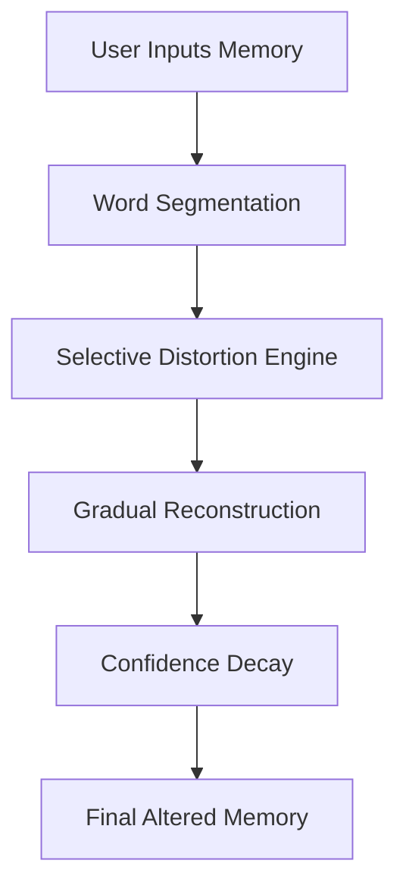

# 🧠 Memory Reconstruction

> *“Are you sure that’s how it happened?”*

---

## 🌌 Overview

**Memory Reconstruction** is an experimental web experience that explores how human memories are **distorted, rewritten, and reconstructed over time**.

Instead of storing memories like a hard drive, our brain constantly **edits them** — adding, removing, and altering details.

This project visualizes that process.

---

## ⚡ Features

✨ Real-time **memory distortion engine**
🎭 Emotion & meaning **shift simulation**
📉 Dynamic **memory confidence meter**
🌗 Progressive **UI mood transition**
🔁 Infinite **reconstruction variations**
👁️ Subtle psychological **prompts & illusions**

---

## 🧪 How It Works



---

## 🎮 Demo Experience

1. Type a personal memory
2. Click **Reconstruct**
3. Watch it slowly change
4. Notice what feels *off*

> ⚠️ The result may feel familiar... but incorrect.

---

## 🧠 Concept Inspiration

* Human cognition & memory bias
* False memory formation
* Psychological reconstruction theory
* Perception vs reality

---

## 🎨 UI Philosophy

* **Minimal → Immersive**
* **Warm → Disturbing tones**
* **Clarity → Uncertainty**

---

## 📂 Project Structure

```
📁 Memory-Reconstruction
 ├── index.html
 ├── README.md
```

---

## 🚀 Run Locally

```bash
# Clone the repository
git clone https://github.com/your-username/memory-reconstruction

# Open in browser
index.html
```

---

## 🔥 Future Enhancements

* 🎙️ Voice-based memory input
* 🌫️ Visual distortion effects (blur, glitch)
* 🤖 AI-driven deep reconstruction
* 🎵 Adaptive background sound design
* 📊 Memory decay visualization graphs

---

## 🧩 Hidden Idea

> The more you revisit a memory,
> the less original it becomes.

---

## 🤝 Contributing

Feel free to fork, experiment, and distort reality further.

---

## 📜 License

MIT License — Use it, break it, reconstruct it.

---

## 🌑 Final Thought

> “Memory is not a recording.
> It’s a story we keep rewriting.”

---

⭐ If this made you question your own memories, give it a star.
